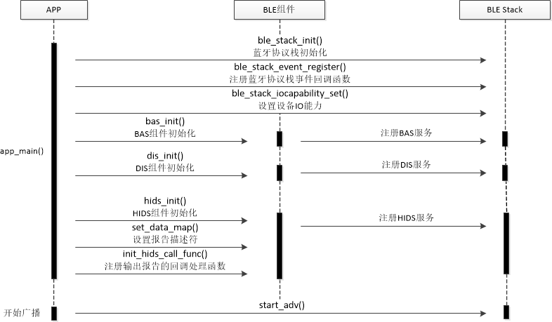
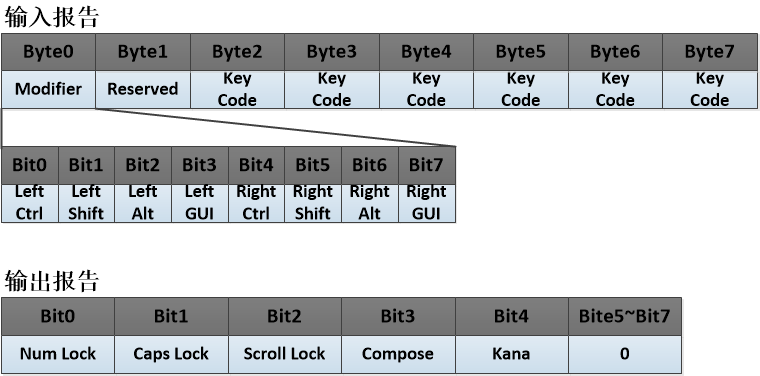
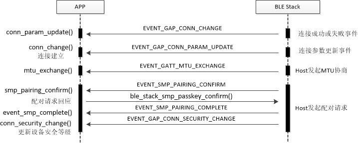

Title:  BLE HID Keyboard应用开发
---

# 1. 简介

蓝牙解决方案里的HID Keyboard是一个典型的BLE Peripheral应用。本文介绍了如何使用蓝牙协议栈进行HID Keyboard应用程序的开发过程。


# 2. BLE HIDS介绍

Bluetooth SIG组织定义了基于BLE的HOGP（HID Over GATT Profile）Profile，该Profile包含HIDS（HID Service）、BAS（Battery Service）、DIS（Device Information Service）服务，其中HIDS提供了人机交互设备的应用框架，BAS提供了电池服务，DIS提供了设备信息服务。一个蓝牙键盘的应用开发基本上是对这三个服务进行开发。在开始开发之前，我们先介绍一下HIDS服务的基础知识，BAS、DIS服务较为简单，这里不做赘述。

HIDS通过报告描述符（Report Map）来定义HID设备的功能。对于蓝牙键盘来说，它主要实现的功能就是蓝牙键盘的按键输入和指示灯控制。蓝牙键盘的按键输入称为Input Report，蓝牙键盘的指示灯控制称为Output Report。他们组成了HIDS的主要特征，其说明如下表所述：

| 特征名称 | 说明 |
| - | - |
| Report Map | 报告描述符，描述了HID Keyboard Device与HID Host传输数据的格式和作用 |
| Report | 包含Input Report、Output Report等子特征 |
| Report: Input Report | HID Keyboard Device通过该特征发送键盘数据到HID Host |
| Report: Output Report | HID Host通过该特征向HID Keyboard Device发送指示灯亮灭状态 |

# 3. 应用开发

本章节介绍了HID Keyboard示例程序的开发流程，包括应用初始化、报告描述符定义、蓝牙协议栈事件处理、键盘指示灯控制、按键键值的上报、电池电量的更新上报和设备信息的配置等。

## 3.1. 应用初始化

应用入口函数为app_main，主要实现蓝牙协议栈的配置，以及HIDS、DIS、BAS组件的初始化。

主要流程如下图所示：



代码分析：

```c
int main(void)
{
    int s_flag;
    /* 定义设备MAC地址以及地址类型 */
    dev_addr_t addr = {DEV_ADDR_LE_RANDOM, DEVICE_ADDR}; 
    /* 蓝牙协议栈初始化参数设置 */
    init_param_t init = {
        .dev_name = DEVICE_NAME,
        .dev_addr = &addr,
        .conn_num_max = 1,
    };  

    /* 板级初始化，各业务模块初始化 */
    board_yoc_init(); 

    /* 向CLI模块注册键盘按键模拟函数 */
    cli_reg_cmd_keysend();  
    
	/* 蓝牙协议栈初始化 */
    ble_stack_init(&init); 

    /* load蓝牙协议栈配置参数，如配对密钥等 */
    ble_stack_settings_load(); 

    /* 注册蓝牙协议栈事件回调函数 */
    ble_stack_event_register(&ble_cb); 

    /* 设置蓝牙设备IO能力 */
    ble_stack_iocapability_set(IO_CAP_IN_NONE | IO_CAP_OUT_NONE); 

    /* Battery Service初始化 */
    g_bas_handle = bas_init(); 
	......
        
    /* Device Information Service初始化 */
    g_dis_handle = dis_init(&dis_info); 
	......
        
    /* HID Service初始化，设置位Report Protocol模式 */
    g_hids_handle = hids_init(HIDS_REPORT_PROTOCOL_MODE); 
    ......

    /* 设置Report Map */
    s_flag = set_data_map(report_map, sizeof(report_map), REPORT_MAP);
    ......

    /* 设置Input Report的数据Buffer地址 */
    s_flag = set_data_map((uint8_t *)(&send_data), sizeof(send_data), REPORT_INPUT);
    ......

    /* 设置Output Report的数据Buffer地址 */
    s_flag = set_data_map(report_output_data, sizeof(report_output_data), REPORT_OUTPUT);
    ......

	/* 注册Output Report的事件回调函数 */
    s_flag = init_hids_call_func(HIDS_IDX_REPORT_OUTPUT_VAL, (void *)event_output_write);
    ......

    /* 开始广播 */
    start_adv();

    return 0;
}
```

## 3.2. 板级初始化

板级初始化的入口为board_yoc_init，主要完成硬件初始化以及OS组件初始化，由app_main函数调用。

```c
void board_yoc_init(void)
{
    int ret = 0;

#ifdef CONFIG_WDT
    /* 硬件看门狗初始化 */
    wdt_init(); 
#endif

    /* disable low power mode when use console */
    disableSleepInPM(1);
    
    /* 管脚复用为UART功能 */
    drv_pinmux_config(P9, UART_TX);
    drv_pinmux_config(P10, UART_RX);
    
	/* 初始化console */
    console_init(CONSOLE_ID, 115200, 128);

    /* 内存管理模块初始化 */
    mm_init();

    /* uart设备注册至设备管理模块 */
    uart_csky_register(0); 

    /* Flash设备注册至设备管理模块 */
    spiflash_csky_register(0); 

    /* 分区管理模块初始化 */
    ret = partition_init();
    ......

    /* KV系统初始化 */
    aos_kv_init("kv");

    /* 蓝牙协议栈LL层初始化 */    
    board_ble_init();

    /* 创建CLI服务 */
    utask_new_ext(&cli_task, "cli_task", cli_task_stack, 2 * 1024, cli_task_queue, QUEUE_MSG_COUNT * 2, AOS_DEFAULT_APP_PRI);
	
    /* 向CLI模块注册系统命令 */
    board_cli_init(&cli_task);    
}

```

## 3.3. 报告描述符定义

在定制开发蓝牙键盘之前，需要先定义报告描述符。下图说明了本示例程序中的报告描述符定义。

- Input Report定义了蓝牙键盘的按键输入报告，共8个字节。Byte0为特殊功能键的定义，每个特殊功能键占位1bit，共定义了8个特殊功能键；Byte1保留；Byte2 ~ Byte7为普通键值的定义，每个键值占位1Byte，共定义了6个普通键值。
- Output Report定义了蓝牙键盘的指示灯输出报告，共1字节。Bit0 ~ Bit4各对应着Num Lock、Caps Lock等指示灯的状态，每个指示灯占位1个Bit，共定义了5个指示灯。Bit5 ~ Bit7为保留位。



下面是示例程序中报告描述符的代码分析，应用程序可以自定义报告描述符格式，在HIDS组件初始化时配置至组件。

```c
static uint8_t report_map[] = {
    /* 定义功能分类为普通桌面页 */
    0x05, 0x01,       // Usage Page (Generic Desktop)

    /* 定义具体用途为键盘 */
    0x09, 0x06,       // Usage (Keyboard)

    /* 功能定义集合开始标识 */
    0xA1, 0x01,       // Collection (Application)

    /* 定义键值输入报告数据结构 */

    /* 特殊功能键键值定义开始 */
    0x05, 0x07,       // Usage Page (Key Codes)

    /* 特殊功能键的键值范围为(0xE0 ~ 0xE7) */
    0x19, 0xe0,       // Usage Minimum (0xE0 -> LeftControl)
    0x29, 0xe7,       // Usage Maximum (0xE7 -> Right GUI)

    /* 该数据位的取值范围为(0,1), 0表示按键放开; 1表示按键按下 */
    0x15, 0x00,       // Logical Minimum (0)
    0x25, 0x01,       // Logical Maximum (1)

    /* 特殊功能键键值占数据位1 Bit, 共使用了8 Bits,即键值输入报告的Byte0 */
    0x75, 0x01,       // Report Size (1)
    0x95, 0x08,       // Report Count (8)

    /* 将特殊功能键键值定义加入到键值输入报告，并设置为可读写绝对值属性 */
    0x81, 0x02,       // Input (Data, Variable, Absolute)

    /* 保留位占数据位1 Byte(8 Bits), 共使用了1 Byte，即键值输入报告的Byte1 */
    0x95, 0x01,       // Report Count (1)
    0x75, 0x08,       // Report Size (8)
    /* 将保留位定义加入到键值输入报告，并设置为只读属性 */
    0x81, 0x01,       // Input (Constant) reserved byte(1)

    /* 普通键键值定义开始 */
    0x05, 0x07,       // Usage Page (Key codes)

    /* 普通键键值占数据位1 Byte(8 Bits), 共使用了6 Bytes, 即键值输入报告的Byte2 ~ Byte7 */
    0x95, 0x06,       // Report Count (6)
    0x75, 0x08,       // Report Size (8)

    /* 特殊功能键的键值范围为(0xE0 ~ 0xE7) */
    0x15, 0x00,       // Logical Minimum (0)
    0x25, 0x65,       // Logical Maximum (101)

    /* 该数据位的取值范围为(0 ~ 101) */
    0x19, 0x00,       // Usage Minimum (0)
    0x29, 0x65,       // Usage Maximum (101)  0x65    Keyboard Application

    /* 将普通键键值定义加入到键值输入报告，并设置为数组属性，表示可同时产生6个键值 */
    0x81, 0x00,       // Input (Data, Array) Key array(6 bytes)

    /* 定义键盘指示灯输出报告数据结构 */

    /* 键盘指示灯状态定义开始 */
    0x05, 0x08,       // Usage Page (Page# for LEDs)

    /* 键盘指示灯状态占数据位1 Bit, 共使用了5 Bits, 即指示灯输出报告的Bit0 ~ Bit4 */
    0x95, 0x05,       // Report Count (5)
    0x75, 0x01,       // Report Size (1)

    /*  键盘指示灯状态的取值范围为(1 ~ 5) */
    0x19, 0x01,       // Usage Minimum (1)
    0x29, 0x05,       // Usage Maximum (5)

    /* 将键盘指示灯状态定义加入到指示灯输出报告，并设置为可读写属性 */
    0x91, 0x02,       // Output (Data, Variable, Absolute), Led report

    /* 保留位占位1 Bit, 共保留了3 Bits, 即指示灯输出报告的Bit5 ~ Bit7 */
    0x95, 0x01,       // Report Count (1)
    0x75, 0x03,       // Report Size (3)

    /* 将保留位定义加入到指示灯输出报告，并设置为可读写属性 */
    0x91, 0x01,       // Output (Data, Variable, Absolute), Led report padding

    /* 功能定义集合结束标识 */
    0xC0              // End Collection (Application)
};
```

## 3.4. 蓝牙协议栈事件处理

蓝牙协议栈的事件是通过event_callback()回调函数上报，应用程序需要对这些事件进行相应的处理，下图列举了主要的蓝牙协议栈事件:



代码分析：

```c
static int event_callback(ble_event_en event, void *event_data)
{
    switch (event) {
        /* 连接成功或失败事件，此时可以开始进行安全等级协商 */
        case EVENT_GAP_CONN_CHANGE:
            conn_change(event, event_data);
            break;
		/* 连接参数更新事件 */
        case EVENT_GAP_CONN_PARAM_UPDATE:
            conn_param_update(event, event_data);
            break;
		/* 配对完成事件 */
        case EVENT_SMP_PAIRING_COMPLETE:
            event_smp_complete(event, event_data);
            break;
		/* 配对确认事件，当前是键盘设备，所以是立即确认，并回发确认消息 */
        case EVENT_SMP_PAIRING_CONFIRM:
            smp_pairing_confirm(event_data);
            ble_stack_smp_passkey_confirm(g_conn_hanlde);
            break;
		/* 配对取消事件 */
        case EVENT_SMP_CANCEL:
            event_smp_cancel(event, event_data);
            break;
		/* 安全等级更新事件 */
        case EVENT_GAP_CONN_SECURITY_CHANGE:
            conn_security_change(event, event_data);
			break;
        default:
            break;
    }

    return 0;
}
```

## 3.5. 键盘指示灯控制

Host对键盘指示灯的控制是通过GATT Write操作来完成的，BLE SDK的HIDS组件将上报HID Output Report事件。应用程序需要处理该事件，并实现键盘指示灯的控制。

主要处理流程如下图：


代码分析：

```c
/* LED点灯函数 */
void Light_Led(CTRL_LED usdata)
{
    if (usdata.bits.Cap_Lock) {
        LOGI(TAG, "Cap_Lock on\r\n");
    }

    if (usdata.bits.Num_Lock) {
        LOGI(TAG, "Num_Lock on\r\n");
    }

    if (usdata.bits.Scroll_Lock) {
        LOGI(TAG, "Scroll_Lock on\r\n");
    }

    if (usdata.bits.Compose) {
        LOGI(TAG, "Compose on\r\n");
    }

    if (usdata.bits.Kana) {
        LOGI(TAG, "Kana on\r\n");
    }
}
/* Output Report事件处理函数 */
static void event_output_write(ble_event_en event, void *event_data)
{
    CTRL_LED led_status;

    evt_data_gatt_char_write_t *e = (evt_data_gatt_char_write_t *)event_data;
    LOGI(TAG, "EVENT_GATT_CHAR_WRITE_CB,%x,%x\r\n", e->len, e->data[0]);

    if (e->len == 1) {
        report_output_data[0] = e->data[0];
        led_status.data = e->data[0]; //output report属性，控制状态灯
        Light_Led(led_status);
    }
}
```

## 3.6. 键值上报

HIDS组件提供了发送按键信息的接口，应用程序只需要实现按键驱动和键值的获取，再调用如下HIDS组件的接口函数将按键信息发送至Host端。

```c
int hids_key_send(hids_handle_t handle, uint8_t *key_code, uint16_t us_len)
```

处理流程如图所示：


## 3.7. 电池电量更新

蓝牙协议栈中提供了BAS服务，应用程序只需要实现电池电量值的采集。当电量发生变化时或者需要周期上报时，可调用如下BAS服务的API实现电量更新上报。

```c
int bas_level_update(bas_handle_t handle, uint8_t level)
```

处理流程如图所示：


## 3.8. 设备信息配置

蓝牙协议栈中实现了DIS服务，应用程序只需要配置DIS服务中的设备信息参数，Client端即可来读取信息内容。

处理流程如图所示：


示例代码：

```c
#define MANUFACTURER_NAME "PINGTOUGE"
#define MODEL_NUMBER "MODE_KEYBOARD"
#define SERIAL_NUMBER "00000001"
#define HW_REV "0.0.1"
#define FW_REV "0.0.2"
#define SW_REV "0.0.3"

static pnp_id_t pnp_id = {
    VEND_ID_SOURCE_USB,
    0x1915,
    0xEEEE,
    0x0001,
};

static dis_info_t dis_info = {
    MANUFACTURER_NAME,
    MODEL_NUMBER,
    SERIAL_NUMBER,
    HW_REV,
    FW_REV,
    SW_REV,
    NULL,
    NULL,
    &pnp_id,
};
```

# 4. 例程运行

BLE HID Keyboard示例程序的运行步骤为：

- 连接串口调试工具, 配置为
  波特率: 115200, 数据位: 8, 校验位: None, 停止位: 1, 流控: None
- 复位开发板
- 设备开始广播后，将在串口上输出‘adv start’信息

```shell
[   0.033]<I>INIT find 7 partitions
Welcome to CLI...
> [   0.261]<I>INIT Build:Oct 22 2020,15:37:29
[   0.278]<I>DEMO Bluetooth HID demo!
[   0.455]<E>DEMO adv start!
```

- 使用手机的系统蓝牙功能，扫描设备
- 连接'YoC-KEYBOARD'设备，等待配对成功
- 使用开发板串口模拟发送键值'a'，手机文本编辑区将显示该键值(注意:当前Solution默认关闭了Cli组件，需在package.yaml里面depends选项打开cli组件依赖)

```shell
> keysend 4
[ 157.298]<D>DEMO key send 4
```

# 5. 参考资料

| Specification                            | 版本 | 下载地址                                                     |
| ---------------------------------------- | ---- | ------------------------------------------------------------ |
| HID SERVICE SPECIFICATION                | 1.0  | [HIDS 1.0](https://www.bluetooth.org/docman/handlers/downloaddoc.ashx?doc_id=245140) |
| HID OVER GATT PROFILE SPECIFICATION      | 1.0  | [HOGP 1.0](https://www.bluetooth.org/docman/handlers/downloaddoc.ashx?doc_id=245141) |
| BATTERY SERVICE SPECIFICATION            | 1.0  | [BAS 1.0](https://www.bluetooth.org/docman/handlers/downloaddoc.ashx?doc_id=245138) |
| DEVICE INFORMATION SERVICE SPECIFICATION | 1.1  | [DIS 1.1](https://www.bluetooth.org/docman/handlers/downloaddoc.ashx?doc_id=244369) |
| HUMAN INTERFACE DEVICE PROFILE           | 1.1  | [HID 1.1](https://www.bluetooth.org/docman/handlers/downloaddoc.ashx?doc_id=309012) |

